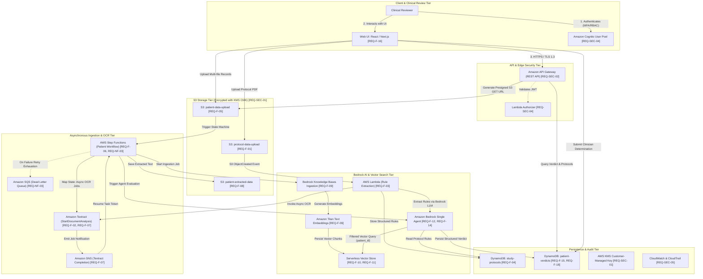
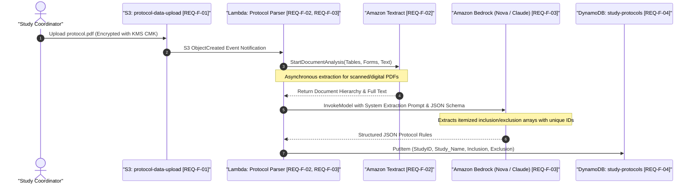
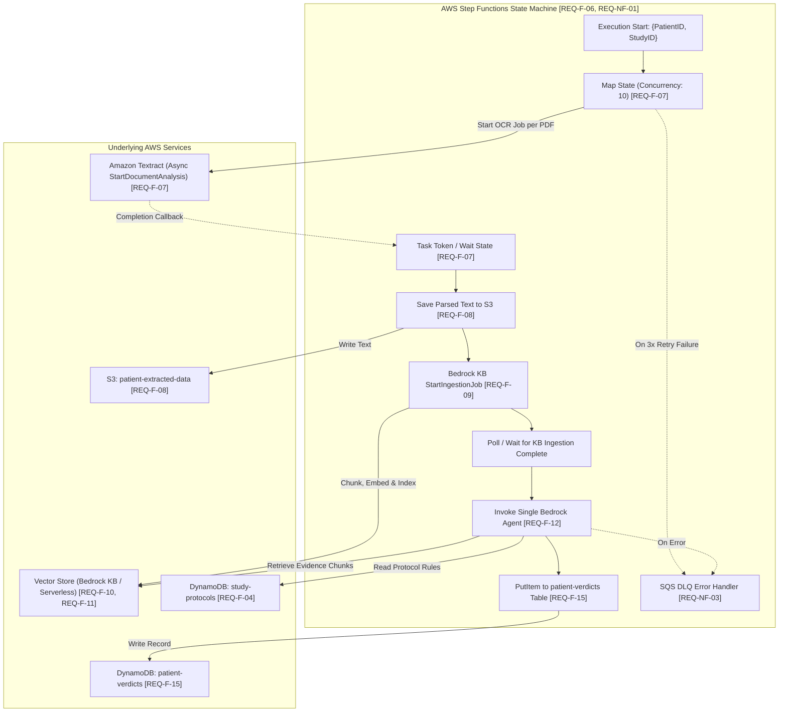
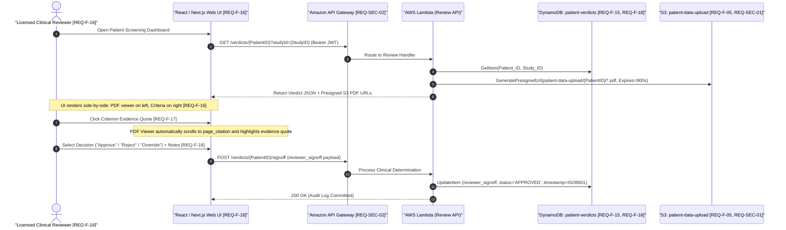
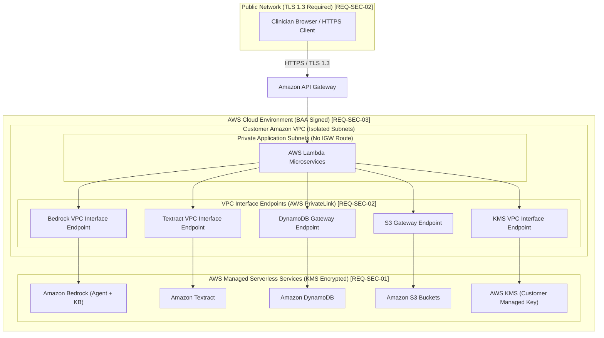

# Architecture.md

## 1. High-Level System Architecture

The AI-Assisted Clinical Trial Screening Platform employs an asynchronous, event-driven, serverless architecture on AWS. The design eliminates 24/7 idle infrastructure costs while providing strict multi-tenant data isolation and HIPAA compliance.

---

## 2. Workflow 1: Protocol Onboarding & Rule Extraction Pipeline

This workflow parses a clinical study protocol PDF (30–100 pages) during trial initialization and extracts itemized inclusion and exclusion criteria into structured DynamoDB records.

### Detailed Pipeline Stages:
1. **Document Ingestion (`[REQ-F-01]`):** The study coordinator uploads `protocol.pdf` to `s3://protocol-data-upload/{StudyID}/`.
2. **Text & Table OCR (`[REQ-F-02]`):** S3 Event Notification triggers the Protocol Ingestion Lambda function. For documents exceeding 5 pages or containing scanned text, Lambda calls Textract `StartDocumentAnalysis` with feature types `TABLES` and `FORMS`.
3. **Structured Rule Extraction (`[REQ-F-03]`):** Extracted markdown text is provided to Bedrock foundation model (Amazon Nova Pro / Anthropic Claude Sonnet 3.5) with a constrained system prompt enforcing the `study-protocols` JSON schema.
4. **Persistence (`[REQ-F-04]`):** Structured rules are written to the `study-protocols` DynamoDB table under primary key `Study_ID`.

---

## 3. Workflow 2: Automated Patient Screening Pipeline

This workflow processes multi-file patient records (up to 150 MB total, digital or scanned faxes/records) and performs RAG-augmented deterministic reasoning against protocol criteria.

### Execution Steps & State Specifications:
1. **Multi-File Trigger (`[REQ-F-05, REQ-F-06]`):** Clinical staff upload 1 or more PDF records to `s3://patient-data-upload/{PatientID}/`. S3 ObjectCreated triggers an EventBridge rule executing the Step Functions state machine.
2. **Parallel Asynchronous OCR (`[REQ-F-07]`):** Step Functions executes a dynamic `Map` state over all uploaded files. Each iteration executes `StartDocumentAnalysis` with an SQS/SNS completion callback.
3. **Raw Text Storage & Ingestion (`[REQ-F-08, REQ-F-09]`):** Extracted text is saved in `s3://patient-extracted-data/{PatientID}/`. Step Functions triggers `StartIngestionJob` on Amazon Bedrock Knowledge Bases.
4. **Vector Embedding & Chunk Metadata (`[REQ-F-10, REQ-F-11]`):** Bedrock Knowledge Bases automatically chunks the text (512 tokens with 20% overlap), generates embeddings using `amazon.titan-embed-text-v2`, and indexes chunks with metadata (`patient_id`, `source_filename`, `page_number`).
5. **Deterministic Single-Agent Reasoning (`[REQ-F-12, REQ-F-13, REQ-F-14]`):**
   * A single Bedrock Agent receives `{PatientID, StudyID}`.
   * Fetches active criteria from DynamoDB `study-protocols`.
   * For each criterion, executes vector retrieval against Bedrock Knowledge Base filtered by `metadata.patient_id == {PatientID}` (`[REQ-NF-02]`).
   * Evaluates evidence and populates JSON schema verdict (`MET`, `NOT_MET`, `UNCERTAIN`) with exact quotes and page numbers.
6. **Persistence & Auditing (`[REQ-F-15]`):** Output verdict written to `patient-verdicts` with default status `PENDING`.

---

## 4. Workflow 3: Human-in-the-Loop Clinical Review Interface

---

## 5. System Boundary & Network Isolation Diagram

