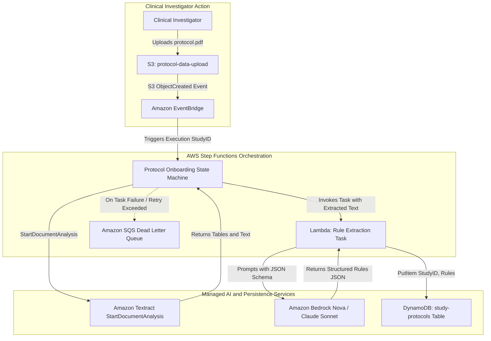
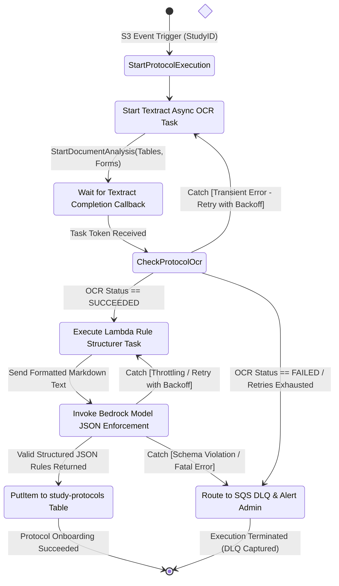
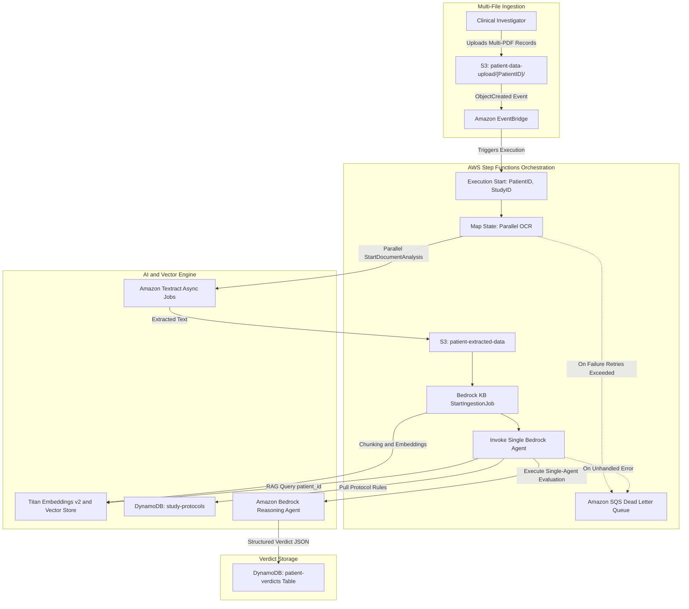
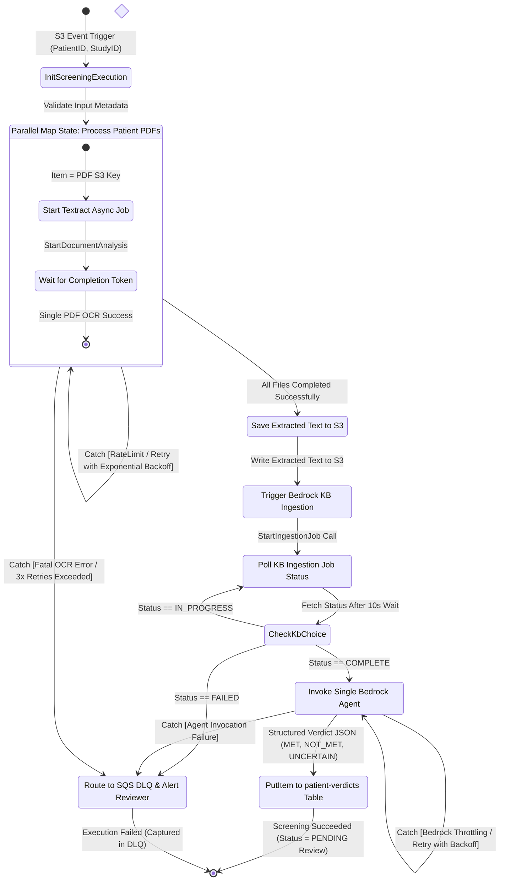
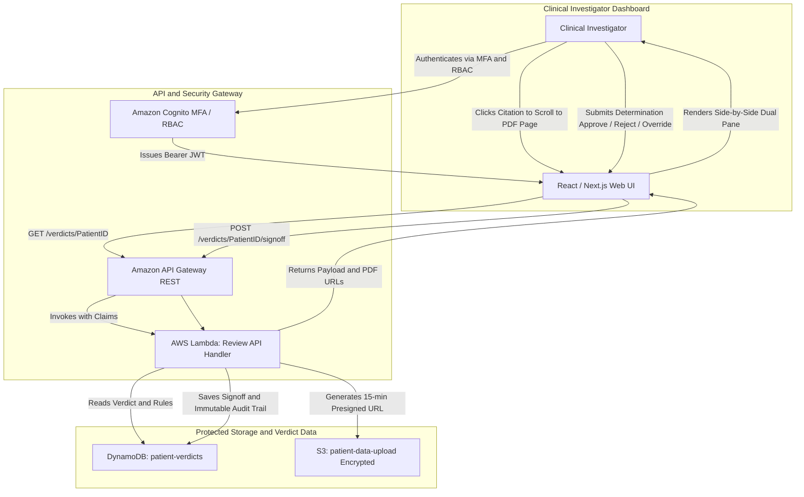

## 1. High-Level System Architecture

The AI-Assisted Clinical Trial Screening Platform employs an asynchronous, event-driven, serverless architecture on AWS. The design eliminates 24/7 idle infrastructure costs while providing strict multi-tenant data isolation and HIPAA compliance.

```mermaid
graph LR
    subgraph Client_Tier ["User and Client Interface"]
        WEB["Clinical Investigator Portal"]
    end

    subgraph Ingestion_Tier ["Storage and Async Ingestion"]
        S3["Amazon S3 Buckets"]
        SFN["AWS Step Functions State Machines"]
        OCR["Amazon Textract OCR"]
    end

    subgraph AI_Engine_Tier ["RAG and AI Reasoning Engine"]
        KB["Bedrock Knowledge Base and Vectors"]
        AGENT["Bedrock Reasoning Agent"]
    end

    subgraph Persistence_Tier ["Structured Persistence and Audit"]
        DDB["Amazon DynamoDB Tables"]
    end

    WEB -->|"Uploads Records and Protocols"| S3
    S3 -->|"Triggers State Machines"| SFN
    SFN -->|"Executes Async OCR"| OCR
    OCR -->|"Indexes Documents"| KB
    KB -->|"Retrieves Context"| AGENT
    AGENT -->|"Saves Rules and Verdicts"| DDB
    DDB -->|"Displays AI Checklist"| WEB
```

---

## 2. Workflow 1: Protocol Onboarding & Rule Extraction Pipeline

This workflow parses a clinical study protocol PDF (30–100 pages) during trial initialization and extracts itemized inclusion and exclusion criteria into structured DynamoDB records using an AWS Step Functions state machine.

### 2.1 Component Flow Diagram

### 2.2 Protocol Onboarding State Machine (`stateDiagram-v2`)

### 2.3 Detailed Pipeline Stages:
1. **Document Ingestion (`[REQ-F-01]`):** The Clinical Investigator uploads `protocol.pdf` to `s3://protocol-data-upload/{StudyID}/`.
2. **State Machine Execution Trigger (`[REQ-F-02]`):** S3 ObjectCreated event routes via Amazon EventBridge to launch the Protocol Onboarding Step Functions state machine with input `{StudyID, Bucket, Key}`.
3. **Asynchronous Layout & Form OCR (`[REQ-F-02]`):** Step Functions starts Amazon Textract `StartDocumentAnalysis` with `TABLES` and `FORMS` feature types, pausing execution until Textract completes.
4. **Structured Rule Extraction (`[REQ-F-03]`):** Step Functions executes a Lambda task passing the extracted text to an LLM on Amazon Bedrock (Amazon Nova Pro / Anthropic Claude 3.5 Sonnet) enforcing the itemized `study-protocols` JSON schema.
5. **Rule Persistence (`[REQ-F-04]`):** Structured rules are written to the `study-protocols` DynamoDB table under primary key `StudyID`.

---

## 3. Workflow 2: Automated Patient Screening Pipeline

This workflow processes multi-file patient records (up to 150 MB total, digital or scanned faxes/records) and performs RAG-augmented deterministic reasoning against protocol criteria using an AWS Step Functions state machine.

### 3.1 Component Flow Diagram

### 3.2 Patient Screening State Machine (`stateDiagram-v2`)

### 3.3 Execution Steps & State Specifications:
1. **Multi-File Trigger (`[REQ-F-05, REQ-F-06]`):** The Clinical Investigator uploads 1 or more PDF records to `s3://patient-data-upload/{PatientID}/`. S3 ObjectCreated triggers an EventBridge rule executing the Step Functions state machine.
2. **Parallel Asynchronous OCR (`[REQ-F-07]`):** Step Functions executes a dynamic `Map` state over all uploaded files. Each iteration executes `StartDocumentAnalysis` with an SQS/SNS completion callback.
3. **Raw Text Storage & Ingestion (`[REQ-F-08, REQ-F-09]`):** Extracted text is saved in `s3://patient-extracted-data/{PatientID}/`. Step Functions triggers `StartIngestionJob` on Amazon Bedrock Knowledge Bases.
4. **Vector Embedding & Chunk Metadata (`[REQ-F-10, REQ-F-11]`):** Bedrock Knowledge Bases automatically chunks the text (512 tokens with 20% overlap), generates embeddings using `amazon.titan-embed-text-v2`, and indexes chunks with metadata (`patient_id`, `source_filename`, `page_number`).
5. **Deterministic Single-Agent Reasoning (`[REQ-F-12, REQ-F-13, REQ-F-14]`):** A single Bedrock Agent receives `{PatientID, StudyID}`, fetches active criteria from DynamoDB `study-protocols`, queries Bedrock Knowledge Base filtered by `metadata.patient_id == {PatientID}` (`[REQ-NF-02]`), and populates the structured JSON verdict (`MET`, `NOT_MET`, `UNCERTAIN`) with citations and exact quotes.
6. **Persistence & Auditing (`[REQ-F-15]`):** Output verdict written to `patient-verdicts` with default status `PENDING`.

---

## 4. Workflow 3: Human-in-the-Loop Clinical Review Interface

This workflow describes the Clinical Investigator review process for reviewing AI-suggested eligibility verdicts alongside original patient documentation.

### 4.1 Reviewer Interaction & Binding Signoff:
1. **Authenticated Access (`[REQ-SEC-04]`):** The Clinical Investigator logs into the portal using Amazon Cognito with Multi-Factor Authentication.
2. **Review Dashboard Loading (`[REQ-F-16]`):** The Web UI requests the verdict payload from API Gateway and receives short-lived (15-minute) S3 presigned URLs for the patient's original PDF records (`[REQ-SEC-01]`).
3. **Interactive Citation Navigation (`[REQ-F-17]`):** Selecting any criterion or extracted evidence quote in the checklist instantly scrolls the embedded PDF viewer to the cited page and highlights the source text.
4. **Binding Determination (`[REQ-F-18]`):** The Clinical Investigator confirms or overrides the AI recommendation, inputs clinical notes, and clicks `Approve`, `Reject`, or `Manual Override`, writing an immutable audit record to `patient-verdicts`.
