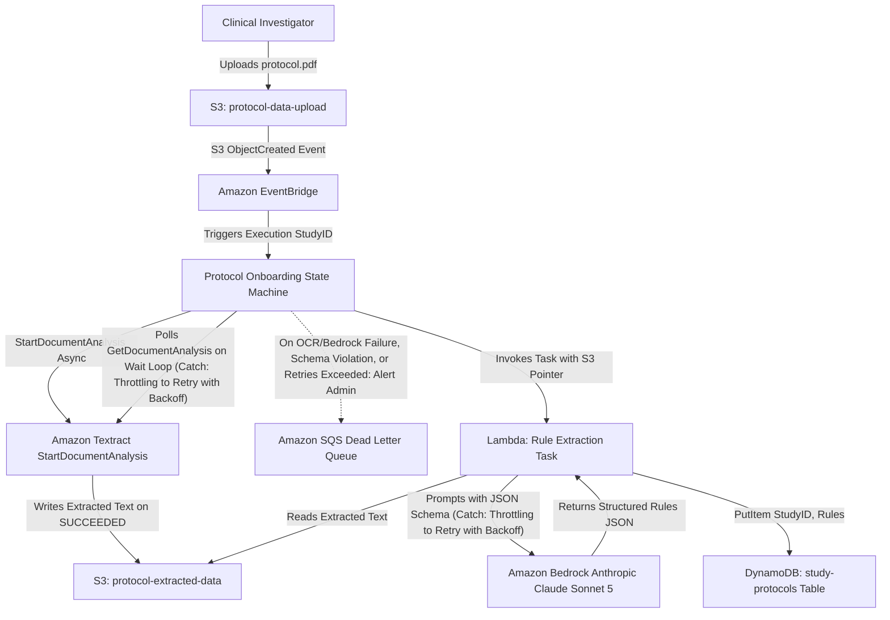
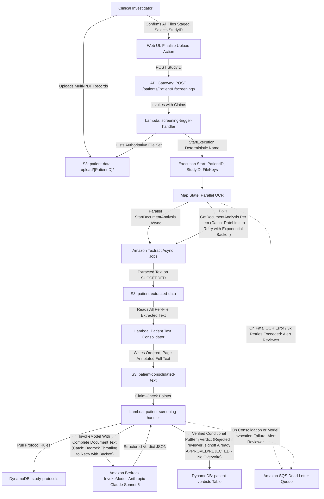
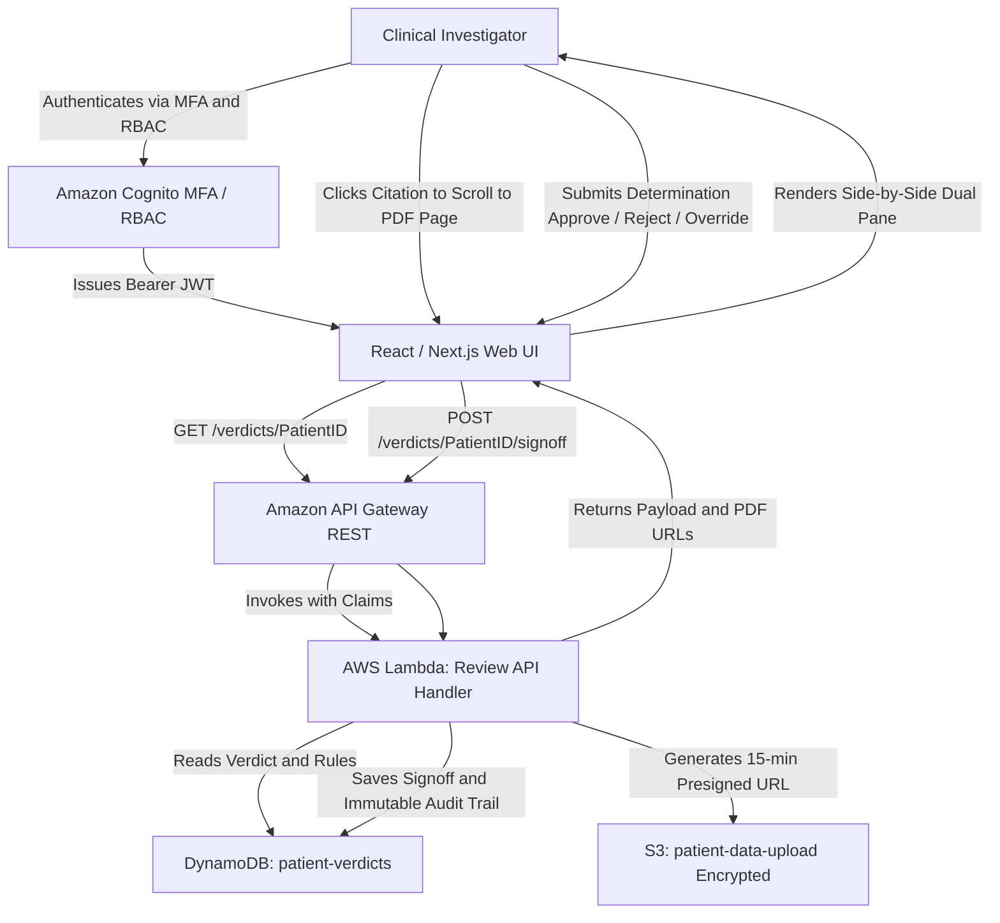

## 1. High-Level System Architecture

The AI-Assisted Clinical Trial Screening Platform employs an asynchronous, event-driven, serverless architecture deployed in AWS Region **`us-west-2` (Oregon)** (`[REQ-OPS-01]`). The design eliminates 24/7 idle infrastructure costs while providing strict multi-tenant data isolation, HIPAA compliance, and payload resiliency using the S3 Claim-Check pattern.

```mermaid
graph LR
    WEB["Clinical Investigator Portal"]
    S3["Amazon S3 Buckets"]
    SFN["AWS Step Functions State Machines"]
    OCR["Amazon Textract OCR"]
    CONSOLIDATE["Full-Text Document Consolidation"]
    AGENT["Bedrock Reasoning Agent"]
    DDB["Amazon DynamoDB Tables"]

    WEB -->|"Uploads Records and Protocols"| S3
    S3 -->|"Triggers State Machines"| SFN
    SFN -->|"Executes Async OCR"| OCR
    OCR -->|"Merges Pages into Full-Text Document"| CONSOLIDATE
    CONSOLIDATE -->|"Delivers Complete Document Context"| AGENT
    AGENT -->|"Saves Rules and Verdicts"| DDB
    DDB -->|"Displays AI Checklist"| WEB
```

---

## 2. Workflow 1: Protocol Onboarding & Rule Extraction Pipeline

This workflow parses a clinical study protocol PDF (30–100 pages) during trial initialization and extracts itemized inclusion and exclusion criteria into structured DynamoDB records using an AWS Step Functions state machine.

### 2.1 Component Flow Diagram

### 2.2 Detailed Pipeline Stages:
1. **Document Ingestion (`[REQ-F-01]`):** The Clinical Investigator uploads `protocol.pdf` to `s3://protocol-data-upload/{StudyID}/`.
2. **State Machine Execution Trigger (`[REQ-F-02]`):** S3 ObjectCreated event routes via Amazon EventBridge to launch the Protocol Onboarding Step Functions state machine with input metadata `{StudyID, Bucket, Key}`.
3. **Asynchronous Table-Preserving OCR (`[REQ-F-03]`):** Step Functions starts Amazon Textract `StartDocumentAnalysis` with the `TABLES` feature type only (`FORMS` was dropped from `[REQ-F-03]` on 2026-08-25 to bring Textract spend within `[REQ-COST-01]`), then polls `GetDocumentAnalysis` on a `Wait`/`Choice` loop (5-second interval) until the job reports `SUCCEEDED`, `FAILED`, or the retry budget is exhausted. Amazon Textract has no native Step Functions `.sync`/`.waitForTaskToken` service integration, so polling — not a callback — is the supported asynchronous pattern.
4. **Structured Rule Extraction & Payload Safety (`[REQ-F-04, REQ-F-05]`):** Textract writes OCR output to the intermediate `protocol-extracted-data` S3 bucket immediately upon job completion. Following the Claim-Check pattern to prevent exceeding the Step Functions 256 KB state limit, Step Functions passes only the S3 object pointer to an AWS Lambda task, which reads the extracted text and sends it to **Anthropic Claude Sonnet 5** on Amazon Bedrock enforcing the itemized `study-protocols` JSON schema.
5. **Rule Persistence (`[REQ-F-06]`):** Structured rules are written to the `study-protocols` DynamoDB table under primary key `StudyID`.

---

## 3. Workflow 2: Automated Patient Screening Pipeline

This workflow processes multi-file patient records (up to 150 MB total, digital or scanned faxes/records) and performs full-document deterministic reasoning against protocol criteria using an AWS Step Functions state machine (`[REQ-F-11], [REQ-F-15]`).

### 3.1 Component Flow Diagram

### 3.2 Execution Steps & State Specifications:
1. **Multi-File Trigger (`[REQ-F-07, REQ-F-08]`):** The Clinical Investigator uploads 1 or more PDF records to `s3://patient-data-upload/{PatientID}/`. Screening is **not** auto-triggered off raw S3 `ObjectCreated` events — S3 fires one such event per uploaded object, and a patient with multiple files (avg. 2/patient per Scope) would otherwise start one incomplete-record execution per file, risking partial-coverage verdicts against `[REQ-NF-05]` and doubling Textract/Bedrock cost. Instead, once the Investigator confirms all files are staged and selects the target `StudyID`, the Web UI calls `POST /patients/{PatientID}/screenings` (Amazon API Gateway, Cognito-authenticated per `[REQ-SEC-04]`) with `{StudyID}`. The `screening-trigger-handler` Lambda lists the `patient-data-upload/{PatientID}/` prefix itself (the authoritative file set, not a client-supplied list) and calls `states:StartExecution` with input `{PatientID, StudyID, FileKeys}`, using an execution name deterministically derived from `PatientID`+`StudyID` so a duplicate or double-clicked trigger call hits Step Functions' `ExecutionAlreadyExists` instead of starting a second concurrent run.
2. **Parallel Asynchronous OCR (`[REQ-F-09]`):** Step Functions executes a dynamic `Map` state over all uploaded files. Each iteration calls `StartDocumentAnalysis`, then polls `GetDocumentAnalysis` on a `Wait`/`Choice` loop (5-second interval) per item until `SUCCEEDED` or `FAILED` — Amazon Textract has no native Step Functions callback integration, so each Map iteration polls independently rather than waiting on a shared notification. **Table-extraction fidelity (flagged, POC-validated 2026-08-31):** naive line-order text assembly scrambles multi-column tables (e.g., a medication list's columns reordered/interleaved) — the Textract-result-processing step (here and in Workflow 1's equivalent Textract call) must reconstruct tables from the `TABLE`/`CELL` block relationships (row/column index) rather than flattened `LINE` reading order, to actually satisfy `[REQ-F-03]`/`[REQ-F-09]`'s "preserve table structures" mandate. A further, unresolved limitation: Textract can silently under-count a row's total columns with zero `ColumnSpan`/metadata signal at all (confirmed against a real medication-table header during POC testing), merging what should be two columns into one with no reliable way to auto-split — POC testing found no geometric heuristic that safely distinguishes a genuine column merge from ordinary word spacing, so this must be accepted as a residual OCR-fidelity risk (the merged field stays fully readable, just not column-separated) rather than guessed apart.
3. **Raw Text Storage & Full-Document Consolidation (`[REQ-F-10, REQ-F-11]`):** Extracted text is saved in `s3://patient-extracted-data/{PatientID}/`, one object per uploaded file. Step Functions invokes the `Lambda: Patient Text Consolidator` task, which reads every per-file object for the `PatientID`, concatenates them in a stable order with explicit source-filename and page-number boundary markers, and writes a single ordered full-text document to `s3://patient-consolidated-text/{PatientID}/`. No chunking or embedding occurs (`[REQ-F-11], [REQ-NF-05]`).
4. **Citation Metadata Preservation (`[REQ-F-13]`):** Every page boundary within the consolidated document retains its `patient_id`, `source_filename`, and `page_number` tags inline, so the reasoning step can still cite an exact source location for every claim without a vector index.
5. **Deterministic Full-Document Reasoning (`[REQ-F-14, REQ-F-15, REQ-F-16, REQ-NF-04, REQ-NF-05]`):** Step Functions invokes `Lambda: patient-screening-handler` with `{PatientID, StudyID}` and the `[REQ-F-11]` S3 Claim-Check pointer (respecting the Step Functions 256 KB state limit, since the full consolidated text — roughly 130,000 tokens for an average 200-page patient record set — would exceed it). The Lambda reads the complete consolidated text from S3, fetches active criteria from DynamoDB `study-protocols`, and makes a single direct `bedrock-runtime:InvokeModel` call to **Anthropic Claude Sonnet 5** (mandated by `[REQ-F-14]`) with the entire patient document passed as direct reasoning input — no retrieval step, no similarity search, and no Bedrock Agent wrapper (the screening step uses no Agent capability, so the Agent layer would add alias/lifecycle management for no functional benefit — see `[REQ-F-14]`). Claude Sonnet 5's verified 1,000,000-token context window (`docs.aws.amazon.com/bedrock/latest/userguide/model-card-anthropic-claude-sonnet-5.html`) comfortably holds the full document at baseline scale. The model first states its reasoning connecting the evidence to each criterion status, then populates one or more structured citations (`MET`, `NOT_MET`, `UNCERTAIN` plus quote/filename/page per citation, `[REQ-F-16]`, §5.2), setting `UNCERTAIN` rather than inferring when no supporting text exists (`[REQ-NF-04]`). As with the protocol-extraction Lambda in Workflow 1, the call targets the Geographic (US) cross-Region inference profile `us.anthropic.claude-sonnet-5` rather than a bare model ID, since Claude Sonnet 5 has no `us-west-2` In-Region support — permitted by the `[REQ-OPS-01]` relaxation; see `Security.md`. **Latency validated via stage-0 POC (2026-08-31):** a test against a real ~39-page patient record (~26,000 input tokens) and a real 42-page protocol (~29,800 input tokens) completed full OCR + protocol extraction + patient OCR + screening in ~111 seconds total — comfortably within the `[REQ-NF-01]` 600-second budget, on the same direct-`InvokeModel` path this design now specifies. Scope limit: this covers a single-file patient record, not a full 150 MB-per-patient upload nor the ~200-page average `Cost.md` models; re-validate at larger record sizes before production deployment.
6. **Citation Verification & Persistence (`[REQ-F-17], [REQ-NF-06]`):** Before persisting, `Lambda: patient-screening-handler` mechanically checks every non-empty citation quote for a literal (whitespace-normalized) substring match against the consolidated patient text (`[REQ-NF-06]`); any citation that fails this check forces `overall_recommendation` to `MANUAL_REVIEW_REQUIRED` regardless of the agent's own value, with the failed citation(s) preserved and surfaced to the reviewer rather than corrected or dropped. This mechanical check is a cheaper, complementary control to `[REQ-SEC-07]`'s Guardrails semantic grounding check — POC testing found the two catch different failure modes (verbatim-but-misattributed vs. topically-relevant-but-not-verbatim). The Lambda then writes the verdict to `patient-verdicts` with default status `PENDING`, using a conditional `PutItem` (`ConditionExpression`: item does not exist, or `reviewer_signoff.status = PENDING`). If a Clinical Investigator has already recorded `APPROVED`/`REJECTED` for this `{PatientID, StudyID}`, the condition fails and the write is rejected rather than silently overwriting the reviewer's binding determination — preserving the immutable audit record required by `[REQ-SEC-05]`. A rejected write is not routed to the general DLQ error path, since it reflects a protected record, not a failure — the conditional write itself (§3.1) is the enforcement point.

---

## 4. Workflow 3: Human-in-the-Loop Clinical Review Interface

This workflow describes the Clinical Investigator review process for reviewing AI-suggested eligibility verdicts alongside original patient documentation.

### 4.1 Reviewer Interaction & Binding Signoff:
1. **Authenticated Access (`[REQ-SEC-04]`):** The Clinical Investigator logs into the portal using Amazon Cognito with Multi-Factor Authentication.
2. **Review Dashboard Loading (`[REQ-F-18]`):** The Web UI requests the verdict payload from API Gateway and receives short-lived (15-minute) S3 presigned URLs for the patient's original PDF records (`[REQ-SEC-01]`).
3. **Interactive Citation Navigation (`[REQ-F-19]`):** Selecting any criterion or extracted evidence quote in the checklist instantly scrolls the embedded PDF viewer to the cited page and highlights the source text.
4. **Binding Determination (`[REQ-F-20]`):** The Clinical Investigator confirms or overrides the AI recommendation, inputs clinical notes, and clicks `Approve`, `Reject`, or `Manual Override`, writing an immutable audit record to `patient-verdicts`.
